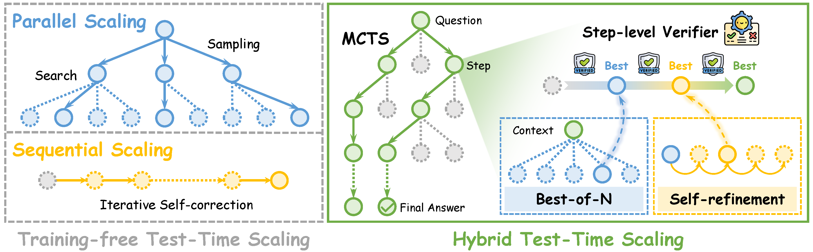

# Step-level Verifier-guided Hybrid Test-Time Scaling for Large Language Models


<p align="center">
  <a href="http://arxiv.org/abs/2507.15512" alt="Paper"></a>
  <a href="https://github.com/openreasoner/openr/tree/critic_mcts" alt="Framework"></a>
  <a href="https://github.com/NiuTrans" alt="NiuTrans"></a>

</p>


<div align="center">
<p align="center" dir="auto">

• 📖 [Introduction](#-introduction) 
• ⚙ [Installation](#-installation) 
• 🤗 [Models](#-models)
• 🚀 [A Quick Start](#-a-quick-start)
• 🔗 [Citation](#-citation)
</p>
</div>

# 📖 Introduction
Recent breakthroughs in large language models (LLMs) on complex reasoning tasks have been largely driven by Test-Time Scaling (TTS) — a paradigm that enhances reasoning by intensifying inference-time computation. TTS methods can be classified into:
- Training-based TTS, such as reinforcement learning and supervised fine-tuning, which train models to produce longer reasoning chains but often incur high training and inference costs.
- Training-free TTS, which explores the solution space during inference via strategies like parallel and sequential scaling. These approaches are cost-efficient and require no additional training, but generally underperform on complex tasks.

✨ We propose **Step-level Verifier-guided Hybrid Test-Time Scaling** (Hybrid TTS), a novel training-free test-time scaling paradigm to further enhance the reasoning capabilities of Large Language Models (LLMs).

We first propose **Conditional Step-level Self-refinement** to validate the effectiveness of fine-grained sequential scaling.
On this basis, we further introduce **Step-level Verifier-guided Hybrid Test-Time Scaling**, which combines parallel (Best-of-N) and sequential (self-refinement) scaling within a step-level tree search.

<p align="center">
  
</p>

Our experiments across five instruction-tuned LLMs (3B–14B) on MATH500, AIME24, and GPQA Diamond datasets show consistent and significant improvements, achieving up to 28.6% performance gain. Notably, our lightweight 3B model outperforms an RL-enhanced 7B baseline on GPQA Diamond by 2.4%.

For a detailed explanation of the method and full experimental results, please refer to our [paper](http://arxiv.org/abs/2507.15512).

# ⚙ Installation
```
conda create -n hybrid_tts python=3.10
conda activate hybrid_tts
pip install -r requirements.txt

cd envs/MATH/latex2sympy
pip install -e .
cd -
```

# 🤗 Models 
Our main experiments employ the following models, which are publicly available on [Huggingface](https://huggingface.co/):
- LLMs
    - `Qwen/Qwen2.5-3B-Instruct`, `Qwen/Qwen2.5-7B-Instruct`, `Qwen/Qwen2.5-14B-Instruct`
    - `meta-llama/Llama-3.1-8B-Instruct`
    - `google/gemma-3-4b-it`
- PRMs
    - `Qwen/Qwen2.5-Math-PRM-7B`
    - `peiyi9979/math-shepherd-mistral-7b-prm`

# 🚀 A Quick Start

### Start vLLM Services
Launch the PRM service:
```bash
CUDA_VISIBLE_DEVICES=0 vllm serve /path/.../Qwen2.5-Math-PRM-7B --task reward --max-model-len 32768 --host 127.0.0.1 --port 8011
```
Launch the LLM service:
```bash
CUDA_VISIBLE_DEVICES=1 vllm serve /path/.../Qwen2.5-14B-Instruct --host 127.0.0.1 --port 8012
```

### Prompt Switching
To run inference on the GPQA dataset, please modify the `COT_TASK_DESC` and `REWRITE_TASK_DESC` from "Common Prompts" to the "GPQA prompts" as needed in the `Hybrid_TTS/envs/critic_MATH/*_prompt.py` files.

### Scripts
The scale of the Hybrid TTS process can be controlled by adjusting the following parameters in the `Hybrid_TTS/reason/evaluation/eval.sh` files:
- `$num_sample_values`: Sets the number of samples for Best-of-N.
- `$num_sequence_values`: Sets the number of search paths for MCTS.
- `$num_refine_values`: Sets the number of iteration rounds for self-refinement.
- Stopping conditions for Self-refinement:
    - The process stops if the PRM score exceeds a threshold: `$prm_threshold_values`.
    - The process stops if the PRM score improvement over `$refine_cut_num_values` consecutive rounds is less than `$prm_gap_values`.


### Inference
```bash
export PYTHONPATH=$(pwd)
bash reason/evaluation/eval.sh
```


# 🔗 Citation
If you find our paper useful for your research, please kindly cite our paper: 
```
@misc{chang2025steplevelverifierguidedhybridtesttime,
      title={Step-level Verifier-guided Hybrid Test-Time Scaling for Large Language Models}, 
      author={Kaiyan Chang and Yonghao Shi and Chenglong Wang and Hang Zhou and Chi Hu and Xiaoqian Liu and Yingfeng Luo and Yuan Ge and Tong Xiao and Jingbo Zhu},
      year={2025},
      eprint={2507.15512},
      archivePrefix={arXiv},
      primaryClass={cs.CL},
      url={https://arxiv.org/abs/2507.15512}, 
}
```
For questions or suggestions, please contact: changkaiyan_neu@outlook.com